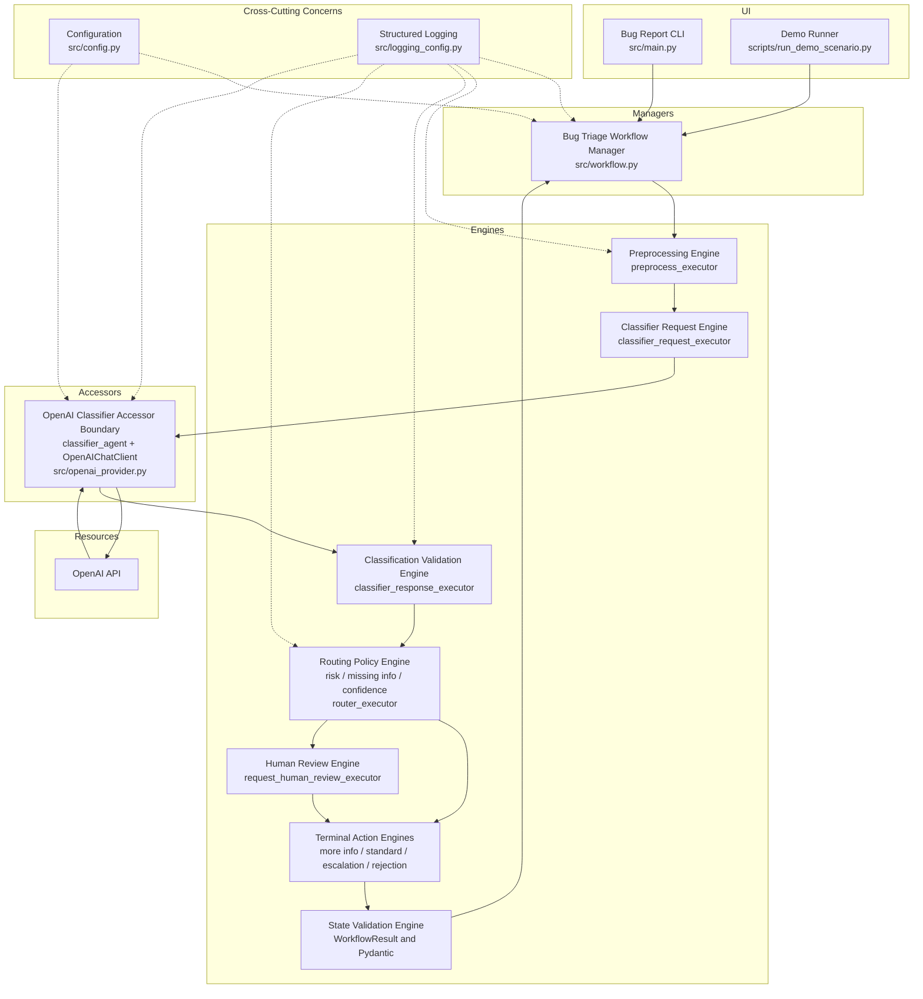
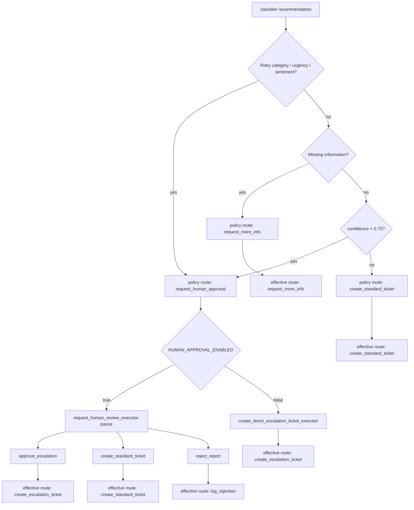
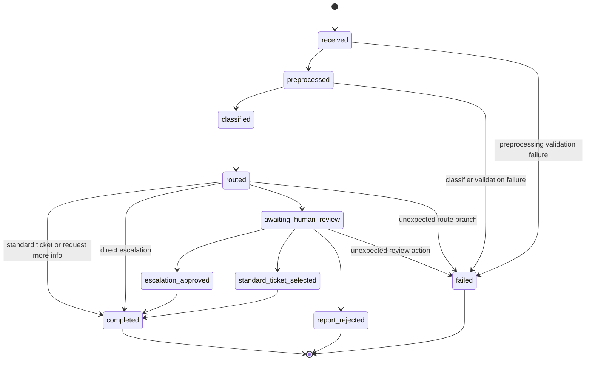

# Bug Triage Workflow with Microsoft Agent Framework

This project is a Python bug-triage workflow built with the Microsoft Agent Framework. It accepts a natural-language bug report, preprocesses it deterministically, classifies it with an OpenAI-backed native agent using SDK-enforced structured output, routes the report through auditable Python policy, and produces a strictly validated `WorkflowResult`. Safety overrides escalate risky reports to human review before any ticket is created; low-confidence classifications pause the workflow for a human decision. The entire run is captured in structured JSON logs.

[](https://github.com/acutedev/bug-triage-workflow-python/actions/workflows/tests.yml)
[](https://www.python.org/downloads/release/python-3120/)
[](./Dockerfile)

## Why This Project Matters

This project demonstrates engineering patterns that matter in production LLM systems:

- **SDK-enforced structured output** — Pydantic validates every classifier response; malformed output becomes a structured failure, not a crash.
- **Deterministic Python policy owns the final route** — the LLM classifies and recommends; auditable Python decides.
- **Safety overrides for risky reports** — security, data-loss, critical, and high-emotion/high-urgency reports are always escalated to a human, regardless of the classifier recommendation.
- **Confidence-based human review** — classifications below the 0.70 threshold pause the workflow for a human decision.
- **Pause/resume human-in-the-loop execution** — the workflow emits an awaiting-review result, prompts the reviewer, and resumes with a typed decision.
- **Adversarial evaluation and auditability** — a trust-boundary instruction guards against prompt injection; opt-in live evals verify robustness.
- **Containerized reproducible execution** — Docker image runs the full workflow without a local Python install.

## End-to-End Example

*Illustrative abbreviated output — model responses vary.*

```
Input
  Users can reset another user's password by changing the account ID in the URL.

Classification
  category:    security
  urgency:     critical
  confidence:  0.95

Classifier recommendation
  request_human_approval

Deterministic policy route
  request_human_approval   ← safety override; Python policy, not model output

Human decision
  approve_escalation

Final outcome
  create_escalation_ticket
```

## Architecture



## Docker Quick-Start

Docker runs the full workflow without installing Python locally. No pre-built image is published; build from source.

```bash
cp .env.example .env
# add LLM_API_KEY to .env
docker build -t bug-triage-workflow .
docker compose run --rm bug-triage --file examples/security_bug.txt
```

Additional input modes:

```bash
# built-in demo report (demonstrates human-review path)
docker compose run --rm bug-triage --demo

# inline text
docker compose run --rm bug-triage --text "The checkout button crashes in Chrome."

# piped stdin — pass -T to disable TTY so piped input flows correctly
cat examples/security_bug.txt | docker compose run --rm -T bug-triage
```

**Piped-stdin and human review:** piped stdin consumes the container's standard input, so the same run cannot later accept an interactive review response. Use `--file` or `--text` for reports that may require human review. For a fully non-interactive piped run:

```bash
cat examples/security_bug.txt | \
  docker compose run --rm -T \
  -e HUMAN_APPROVAL_ENABLED=false \
  bug-triage
```

When the workflow pauses for human review, Docker's default TTY (`tty: true` in `docker-compose.yml`) supports the interactive prompt. Piped-stdin runs (`-T`) cannot drive that prompt.

`.env` is passed to the container at runtime and is listed in `.dockerignore`; it is never copied into the image.

## Local Python Quick-Start

```bash
python3 -m venv .venv
source .venv/bin/activate
python -m pip install -r requirements.txt
cp .env.example .env
# add LLM_API_KEY to .env
python -m src.main --file examples/security_bug.txt
```

All four input modes work locally:

```bash
python -m src.main --demo
python -m src.main --text "The checkout button crashes in Chrome."
python -m src.main --file examples/security_bug.txt
cat examples/security_bug.txt | python -m src.main
```

**Configuration variables** (`LLM_PROVIDER`, `LLM_API_KEY`, `LLM_MODEL`, `HUMAN_APPROVAL_ENABLED`) are documented in the [Configuration](#configuration) section below.

## Quality Gates

| Gate | Command | CI | Current evidence |
|---|---|---|---|
| Deterministic test suite | `python -m pytest` | Yes | 332 passed, 6 skipped |
| Focused CLI/logging tests | `python -m pytest tests/test_main.py tests/test_logging_config.py -v` | No | 41 passed |
| Python compilation | `python -m compileall src tests scripts -q` | Not yet | Passed locally |
| Docker build | `docker build -t bug-triage-workflow .` | Not yet | Passed locally |
| Docker CLI smoke test | `docker run --rm bug-triage-workflow --help` | Not yet | Passed locally |
| Docker non-root check | `docker run --rm --entrypoint id bug-triage-workflow` | Not yet | uid=1000(appuser) |
| Live adversarial evaluations | `python -m pytest tests/eval -m eval --run-evals -v` | No, opt-in | 6 passed |
| Secret and tracked-file audit | Documented release-audit commands below | No | Passed locally; reverify before public release |

The GitHub Actions workflow (`.github/workflows/tests.yml`) installs dependencies on Python 3.12 and runs `python -m pytest` (deterministic suite only).

## Core Engineering Decisions

- **LLM classification, Python routing** — natural-language bug reports vary in wording, detail, tone, and severity, making LLM classification the right fit. Routing remains deterministic so risky decisions are controlled by auditable Python policy, not by model output alone.
- **Safety overrides before confidence** — risk-based routing (security, data-loss, critical, or high-emotion/high-urgency) takes precedence over everything else, including classifier confidence and missing-information checks.
- **Confidence threshold as an explicit policy gate** — `route_triage` reads `TriageClassification.confidence` directly. A score below 0.70 routes to human review. This is not a claim that model confidence is perfectly calibrated; it is a policy gate.
- **Structured failure over silent crash** — malformed classifier output becomes `WorkflowResult(status=failed)`. Unexpected faults (provider errors, router errors, invariant failures) propagate to the caller so defects are not hidden.
- **Automated tests use fakes** — live OpenAI calls add cost, latency, external availability risk, and nondeterminism. Real OpenAI behavior is demonstrated through validated demo outputs and opt-in live evaluations.
- **`report_rejected` is distinct from `completed`** — rejection is a terminal business outcome, not a completed ticket-handling action.
- **IDesign logical boundaries in one process** — separately deployed microservices would add unnecessary operational complexity for this scope. The architecture is intended to show where those boundaries would live in a production system.

---

## Detailed Architecture and Workflow Documentation

### IDesign Architecture Alignment

The implementation is split into small modules with clear responsibilities and follows an IDesign-inspired separation of UI, Manager, Engine, Accessor, Resource, and cross-cutting concerns. These are logical in-process boundaries appropriate to the scope of this project; they are not independently deployed services.

- `src/config.py` loads `LLM_PROVIDER`, `LLM_API_KEY`, `LLM_MODEL`, and `HUMAN_APPROVAL_ENABLED`.
- `src/preprocess.py` normalizes raw reports, extracts obvious metadata, and detects missing information.
- `src/classifier.py` builds the classifier prompt and parses OpenAI classifier responses into `TriageClassification`.
- `src/openai_provider.py` creates the native Microsoft Agent Framework `Agent` backed by `OpenAIChatClient`.
- `src/router.py` applies deterministic routing policy in `route_triage`.
- `src/workflow.py` builds the Microsoft Agent Framework workflow in `build_bug_triage_workflow`.
- `src/human_approval.py` implements `HumanReviewExecutor`, `request_review()`, and human-review response handling.
- `src/models.py` defines strict Pydantic models, enums, and workflow-state validation.
- `src/workflow_messages.py` defines internal transport messages between executors.
- `src/workflow_results.py` builds completed and failed `WorkflowResult` values.
- `src/workflow_trace.py` maintains the per-run workflow event trace.
- `src/logging_config.py` configures JSON logging.
- `src/main.py` provides the CLI, supporting `--demo`, `--text`, `--file`, and piped stdin input.
- `scripts/run_demo_scenario.py` runs and validates the ten demo scenarios.

The project applies the IDesign principles at a scale appropriate for a single-process Python workflow:

- **UI:** `src/main.py` and `scripts/run_demo_scenario.py` initiate user stories and present workflow output. They do not own classification or routing policy.
- **Manager:** `src/workflow.py` coordinates the end-to-end user story, delegates work to focused components, handles branching, and owns orchestration rather than external-resource details.
- **Engines:** preprocessing, classification parsing, deterministic routing, human-review handling, terminal-action construction, and state validation are separated into focused processing components.
- **Accessor:** the OpenAI classifier Accessor boundary consists of the injected `classifier_agent`, its `OpenAIChatClient`, and the construction logic in `src/openai_provider.py`. Business routing and workflow orchestration do not depend on OpenAI client details.
- **Resource:** the current external resource is the OpenAI API. A production version would add separate accessors for a ticketing system, durable workflow storage, reviewer identity, notifications, and audit storage.
- **Cross-cutting concerns:** configuration, JSON logging, validation, and exception policy are kept separate from the core business flow.

The conceptual business-flow direction is intentionally controlled:

```text
UI -> Workflow Manager -> Engines -> Accessors -> Resources
```

The CLI also acts as the composition root: it loads configuration, constructs the OpenAI-backed classifier dependency, and injects that dependency into the Workflow Manager before execution begins.

### Workflow Routes and Human Review

The route names are defined by `RouteName`:

- `request_more_info`: the report does not contain enough useful detail, so the workflow asks for clarification.
- `create_standard_ticket`: the report is complete enough for standard-ticket handling.
- `request_human_approval`: the report is risky or the classifier confidence is below the review threshold, so human review is required before final handling.
- `create_escalation_ticket`: escalation-ticket handling was selected.
- `log_rejection`: a human reviewer rejected the report.

There are three related routing concepts:

- Classifier recommendation: the LLM recommendation in `TriageClassification.recommended_route`.
- Deterministic policy route: the route selected by `route_triage`.
- Effective final route: the terminal route recorded in the final `WorkflowResult`.

The deterministic router can override the classifier recommendation. Routing precedence is applied in the following order:

1. Risky security, data-loss, critical, or high-emotion/high-urgency reports route to `request_human_approval`.
2. Missing information routes to `request_more_info`.
3. A classifier confidence score below `LOW_CONFIDENCE_HUMAN_REVIEW_THRESHOLD` (0.70) routes to `request_human_approval`. A score of exactly 0.70 is not considered low confidence and does not trigger this rule.
4. All remaining reports route to `create_standard_ticket`.

When human review is disabled, a policy route of `request_human_approval` is handled by `create_direct_escalation_ticket_executor` regardless of what triggered that route — including low-confidence cases. In that case, the routed event can preserve the policy route while the final result records the effective route `create_escalation_ticket`.



Human review is implemented by `HumanReviewExecutor` with executor ID `request_human_review_executor`. The workflow emits an awaiting-review `WorkflowResult`, then calls Microsoft Agent Framework `request_info` with a typed `HumanReviewRequest`. The CLI and demo runner resume the workflow by supplying a `HumanReviewDecision`.

Reviewer decisions and outcomes:

- `approve_escalation` routes to `create_escalation_ticket_executor`.
- `create_standard_ticket` routes to `create_standard_ticket_executor`.
- `reject_report` routes to `log_rejection_executor`.

Relevant statuses: `awaiting_human_review`, `escalation_approved`, `standard_ticket_selected`, `report_rejected`.

Human-review fields:

- `human_review_required`: whether a human decision was part of the terminal outcome.
- `human_review_action`: the selected `HumanReviewAction`, or `null` when no review action applies.
- `approval_granted`: `true` for approved escalation, `false` for rejection, and `null` for standard-ticket override or no review.

### Workflow Status Semantics

`WorkflowResult.status` describes whether and how the workflow terminated. `selected_route` describes the business outcome selected. `final_action` describes the terminal action produced, when there is one.

- `completed` means the workflow successfully executed its selected terminal action. It does not always mean a bug ticket was created.
- `completed` plus `request_more_info` means the workflow successfully decided to request more information.
- `completed` plus `create_standard_ticket` means standard-ticket handling was selected.
- `completed` plus `create_escalation_ticket` means escalation-ticket handling was selected.
- `report_rejected` is a distinct terminal business outcome for human rejection.
- `failed` means validation or processing could not complete successfully.

### State Model

The state model is enforced by strict Pydantic validation in `WorkflowResult`. Invalid combinations of workflow status, selected route, classification, review fields, approval value, final action, and error are rejected.

Representative valid progressions:

- Standard ticket: `received -> preprocessed -> classified -> routed -> completed`
- Request more information: `received -> preprocessed -> classified -> routed -> completed`
- Escalation approved: `received -> preprocessed -> classified -> routed -> awaiting_human_review -> escalation_approved -> completed`
- Standard-ticket override: `received -> preprocessed -> classified -> routed -> awaiting_human_review -> standard_ticket_selected -> completed`
- Report rejected: `received -> preprocessed -> classified -> routed -> awaiting_human_review -> report_rejected`
- Classifier validation failure: `received -> preprocessed -> failed`



---

## Testing

Run the full automated test suite:

```bash
python -m pytest
```

Current verified result: **332 passed, 6 skipped**

The automated tests use fakes, stubs, mocks, and deterministic responses. The default suite does not call OpenAI, which keeps it fast, repeatable, inexpensive, and safe for CI. Real OpenAI behavior is demonstrated through the validated demo outputs and opt-in live evaluations.

### Live Adversarial Evaluations

An opt-in live-eval suite exercises the real OpenAI-backed classifier against adversarial inputs:

```bash
python -m pytest tests/eval -m eval --run-evals -v
```

The `-m eval` flag selects tests carrying the `eval` marker. The `--run-evals` flag explicitly authorizes their execution; without it the eval tests are skipped even when selected by `-m eval`. Live evals require a valid OpenAI API configuration and incur API usage. They are intentionally excluded from the default `python -m pytest` run to keep the default suite deterministic and free of external dependencies.

Verified live-eval result using `gpt-4.1-mini`: **6 passed**

## Demo Evidence

Run a validated scenario:

```bash
python scripts/run_demo_scenario.py <scenario>
```

Supported scenario names: `standard-ticket`, `request-more-info`, `escalation-approved`, `standard-ticket-selected`, `report-rejected`, `direct-escalation`, `classifier-failure`, `adversarial-security`, `adversarial-benign-quote`, `low-confidence-review`.

Scenarios `standard-ticket` through `direct-escalation` and both `adversarial-*` scenarios use the real OpenAI-backed classifier. `classifier-failure` and `low-confidence-review` use deterministic fake classifier responses and do not call OpenAI.

To capture output:

```bash
PYTHONWARNINGS=ignore python scripts/run_demo_scenario.py standard-ticket \
  2>&1 | tee docs/demo_01_standard_ticket.txt
```

Validated scenario outputs:

- [docs/demo_01_standard_ticket.txt](docs/demo_01_standard_ticket.txt): ordinary complete report reaches standard-ticket handling.
- [docs/demo_02_request_more_info.txt](docs/demo_02_request_more_info.txt): incomplete report produces a request-information outcome.
- [docs/demo_03_escalation_approved.txt](docs/demo_03_escalation_approved.txt): workflow pauses, resumes, and creates escalation handling.
- [docs/demo_04_standard_ticket_selected.txt](docs/demo_04_standard_ticket_selected.txt): reviewer overrides escalation and selects standard-ticket handling.
- [docs/demo_05_report_rejected.txt](docs/demo_05_report_rejected.txt): reviewer rejects the report.
- [docs/demo_06_direct_escalation_review_disabled.txt](docs/demo_06_direct_escalation_review_disabled.txt): review-disabled configuration bypasses the human-review pause.
- [docs/demo_07_classifier_output_failure.txt](docs/demo_07_classifier_output_failure.txt): malformed classifier output becomes a structured failed result.
- [docs/demo_08_adversarial_security.txt](docs/demo_08_adversarial_security.txt): adversarial report embedding prompt-injection instructions is correctly classified as a security issue and routed for human approval.
- [docs/demo_09_adversarial_benign_quote.txt](docs/demo_09_adversarial_benign_quote.txt): benign report quoting adversarial-style text is correctly classified as a UI bug and routed to a standard ticket.
- [docs/demo_10_low_confidence_review.txt](docs/demo_10_low_confidence_review.txt): deterministic fake classifier emits a complete UI_BUG classification with confidence 0.60, triggering the low-confidence human-review route; the reviewer selects standard-ticket handling. Does not call OpenAI.

## Logging

`src/logging_config.py` configures a JSON logger named `bug_triage_workflow`. Child loggers include modules such as `bug_triage_workflow.preprocess`, `bug_triage_workflow.classifier`, `bug_triage_workflow.router`, and `bug_triage_workflow.openai_provider`.

Log entries include `timestamp`, `level`, `logger`, `message`, optional `extra` fields, and optional formatted exception text. Workflow and executor context is included where applicable. Examples include `executor`, `selected_route`, `recommended_route`, `category`, `urgency`, `sentiment`, `missing_info_count`, and `extracted_field_names`.

The provider logs the model name, but not the API key. Tests verify that API keys are not written to provider logs.

**Provider failure handling:** when a provider error occurs, the CLI prints a normalized safe message to the terminal; full exception details are written to a dedicated diagnostic logger that does not propagate to the main application log. Diagnostic output goes to a process-specific file in the OS temporary directory by default, restricted to mode 0600 with bounded log rotation. The path can be overridden with the `BUG_TRIAGE_DIAGNOSTIC_LOG` environment variable. If the diagnostic file cannot be initialized, the CLI starts normally without it.

## Security and Repository Hygiene

Implemented safeguards:

- `.env` is ignored by Git. No credentials are committed.
- The workflow uses strict input and output models.
- CLI error messages avoid exposing internal exception details for unexpected failures.
- Secret scanning was performed on tracked files. Local-path scanning was performed on tracked files. Demo outputs were sanitized.
- A secret-shaped test fixture is split as `"sk-" + "demo-secret-should-not-print"` to avoid false-positive repository scans.
- The classifier prompt includes a trust-boundary instruction that instructs the model to treat all user-supplied text as untrusted data and to ignore embedded instructions.
- Adversarial evaluations (`tests/eval/`) verify that prompt-injection attempts in bug reports are handled correctly and that benign reports quoting adversarial-style text are not mis-classified. Six live-eval cases passed using `gpt-4.1-mini`.

These are implementation safeguards and evaluations for this project. They are not a formal security audit or a production security guarantee. Additional production hardening is listed under Next Steps for Production Readiness.

Release-audit commands (run before any public release; reverify each time):

```bash
git secrets --scan               # or: truffleHog / gitleaks
grep -rE 'sk-[A-Za-z0-9]{20,}' .
grep -rE '/Users/|/home/' docs/ scripts/ src/ tests/
```

## Exception Policy

Expected validation failures become structured workflow results:

```text
WorkflowResult(status=failed)
```

This includes invalid or blank input rejected during preprocessing and malformed or schema-invalid classifier output rejected during classifier-response parsing.

Unexpected exceptions propagate to the caller. They are not converted into `WorkflowResult(status=failed)`. Propagated exceptions include:

- OpenAI or provider failures
- router failures
- terminal-executor failures
- Microsoft Agent Framework failures
- invariant failures
- programming defects

The CLI boundary logs propagated unexpected exceptions, prints a safe user-facing message, and returns a nonzero exit code. It does not expose raw tracebacks for expected operational errors.

## Configuration

Supported configuration variables:

- `LLM_PROVIDER`: must be `openai`.
- `LLM_API_KEY`: required for real OpenAI-backed classifier runs.
- `LLM_MODEL`: defaults to `gpt-4.1-mini` when unset.
- `HUMAN_APPROVAL_ENABLED`: accepts boolean-like values such as `true`, `false`, `yes`, `no`, `1`, or `0`; defaults to `true`.

`.env` is listed in `.gitignore` and is not tracked by Git.

CLI exit codes implemented in `src/main.py`:

- `0`: success
- `2`: configuration validation problem or invalid / missing input
- `1`: provider error, EOF while waiting for input, or unexpected runtime failure
- `130`: keyboard interruption

## Project Structure

```text
.
├── .dockerignore
├── .env.example
├── .github/
│   └── workflows/
│       └── tests.yml
├── .gitignore
├── README.md
├── Dockerfile
├── docker-compose.yml
├── docs/
│   ├── demo_01_standard_ticket.txt
│   ├── demo_02_request_more_info.txt
│   ├── demo_03_escalation_approved.txt
│   ├── demo_04_standard_ticket_selected.txt
│   ├── demo_05_report_rejected.txt
│   ├── demo_06_direct_escalation_review_disabled.txt
│   ├── demo_07_classifier_output_failure.txt
│   ├── demo_08_adversarial_security.txt
│   ├── demo_09_adversarial_benign_quote.txt
│   └── demo_10_low_confidence_review.txt
├── examples/
│   └── security_bug.txt
├── pytest.ini
├── requirements.txt
├── scripts/
│   └── run_demo_scenario.py
├── src/
│   ├── classifier.py
│   ├── config.py
│   ├── human_approval.py
│   ├── logging_config.py
│   ├── main.py
│   ├── models.py
│   ├── openai_provider.py
│   ├── preprocess.py
│   ├── router.py
│   ├── workflow.py
│   ├── workflow_messages.py
│   ├── workflow_results.py
│   └── workflow_trace.py
└── tests/
    ├── eval/
    │   └── test_adversarial_classifier.py
    ├── test_classifier.py
    ├── test_cli_input.py
    ├── test_config.py
    ├── test_demo_scenarios.py
    ├── test_logging_config.py
    ├── test_main.py
    ├── test_models.py
    ├── test_openai_provider.py
    ├── test_preprocess.py
    ├── test_router.py
    └── test_workflow.py
```

## Known Limitations

- The CLI accepts a report via `--demo`, `--text`, `--file`, or piped stdin; there is no interactive multi-field entry form.
- There is no persistent external ticket-system integration.
- Ticketing, workflow persistence, reviewer identity, notifications, and audit storage do not yet have production Accessor and Resource implementations.
- IDesign roles are represented as logical in-process component boundaries rather than independently deployed services.
- Workflow pause/resume state is not durably persisted across process restarts.
- OpenAI model output can vary.
- The default `python -m pytest` suite does not call OpenAI; live evals are opt-in via `python -m pytest tests/eval -m eval --run-evals -v`.
- Human review is terminal-based rather than a production UI.
- There is no production authentication or authorization layer.
- Microsoft Agent Framework experimental warnings remain.
- There is no production deployment configuration beyond a basic Docker image.

## Next Steps for Production Readiness

The following items are future work, not current functionality.

Code quality:

- Add Ruff.
- Add MyPy or Pyright.
- Optionally add Black.
- Add pre-commit hooks.
- Add stricter documentation checks.

CI/CD:

- Expand GitHub Actions to cover dependency installation, automated tests, linting, type checking, `compileall`, README link validation, and secret scanning.
- Add branch protection and required status checks.
- Use protected production environments for deployment workflows.

Dependency management:

- Add a lockfile or constraints file.
- Use reproducible dependency resolution.
- Add automated dependency updates.
- Add vulnerability scanning.
- Add dependency-license review.

Testing:

- Live OpenAI adversarial evaluations exist in `tests/eval/` and are already opt-in. Expand coverage to include additional adversarial categories, edge cases, and model variants.
- Keep live provider tests opt-in because of API cost, latency, external availability, rate limits, and nondeterministic model output.
- Test interactive multi-field bug entry if that CLI mode is added.
- Test OpenAI timeout behavior, rate-limit behavior, and malformed provider responses.
- Continue testing router exceptions and terminal-executor exceptions.
- Add coverage for unknown request IDs, duplicate resume attempts, invalid reviewer responses, empty input, and oversized reports.
- Add property-based tests.
- Add model state-machine tests.
- Add concurrency, load, and recovery tests.

Reliability:

- Add explicit end-to-end timeouts.
- Add bounded retries with exponential backoff.
- Add a circuit breaker.
- Define idempotency behavior for ticket creation, human-review submission, and workflow resume.
- Add duplicate-event protection.
- Add durable pause/resume persistence.
- Add workflow recovery after restart.
- Add dead-letter handling.
- Make external ticket creation transactional.
- Make external integrations retry-safe.

Observability:

- Add correlation IDs and request IDs.
- Add distributed tracing.
- Add metrics, dashboards, and alerting.
- Monitor latency and error rates.
- Monitor route distribution.
- Monitor token usage and cost.
- Monitor human-review queue metrics.

Security and privacy:

- Move secrets to managed secrets storage.
- Add PII and sensitive-data redaction.
- Define retention policies.
- Add audit trails.
- Add reviewer authentication and authorization.
- Enforce least-privilege access.
- Harden prompt-injection defenses beyond the current trust-boundary instruction (e.g., input sanitization, output validation, red-team testing, defense-in-depth layers).
- Add model-output security review.
- Require encryption in transit and at rest for production data stores and integrations.
- Define a secure logging policy.

Input and API hardening:

- Add request-size limits.
- Add schema versioning.
- Add API authentication and authorization.
- Add rate limiting.
- Enforce content types.
- Validate attachments if attachments are added.
- Handle malicious content explicitly.
- Add normalization limits.

Deployment and operations:

- Add health checks, readiness probes, and a production-grade container orchestration setup (Kubernetes, ECS, etc.).
- Add environment-specific configuration.
- Add staged deployment and rollback strategy.
- Add startup configuration validation.
- Add backups where applicable.
- Add disaster recovery procedures.
- Add operational runbooks.

Product integration:

- Add real ticketing-system adapters.
- Integrate with Jira, GitHub Issues, or another ticketing service.
- Add reporter notifications.
- Build a reviewer UI.
- Add a persistent workflow store.
- Add SLA rules.
- Make routing policy configurable.
- Add escalation queues and assignment rules.
- Add a feedback loop from resolved tickets.
- Add analytics for classifier and routing quality.
